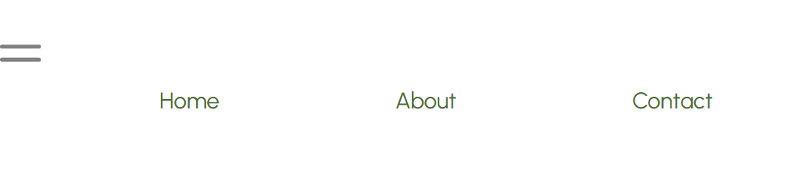
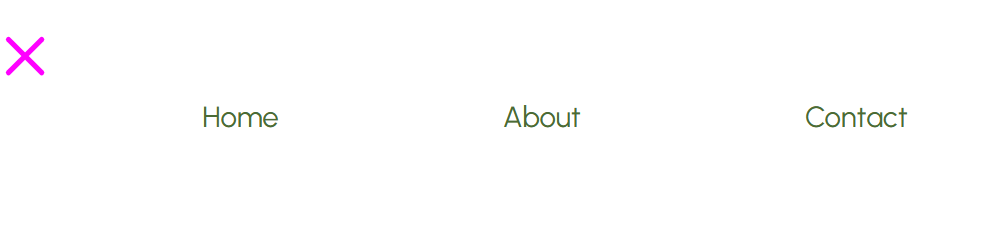
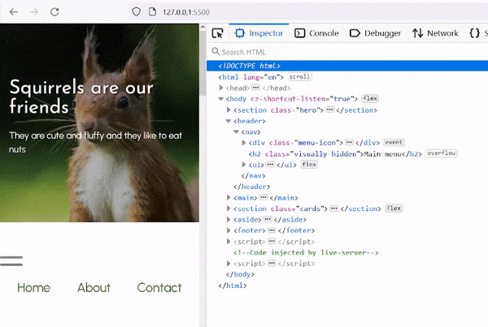
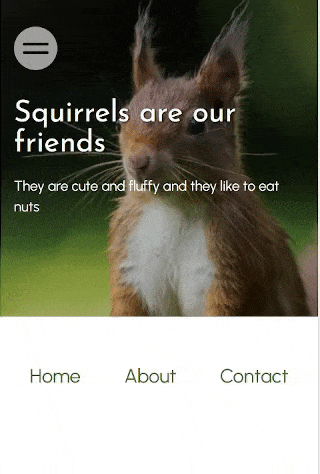
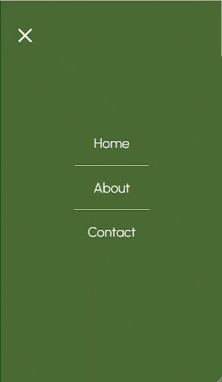
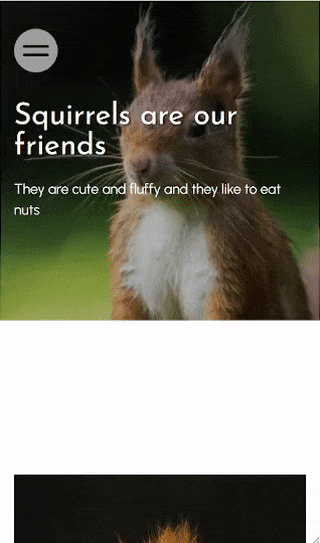

<!-- cSpell:enable  -->

# Responsive menu

**Objectives**: Add a dropdown menu for mobile devices.

**Concepts covered**: Flexbox, responsive design, media queries, SVG animation, element animation, basic JavaScript event listeners.

In this assignment you will convert your main menu to a hamburger-style dropdown menu for mobile devices. Use the mobile-first design principles on your menu: the base CSS will be the mobile layout. Media queries will convert the menu back to a standard horizontal menu for larger screens.

On mobile, the menu should be hidden by default. Display an SVG menu icon instead. Use animation techniques we learned earlier in the semester to have the SVG toggle between a hamburger icon and a close icon. The menu should appear (and disappear) when the user clicks on the icon.

I posted a video walkthrough from a previous semester for this assignment on Learning Suite (Content -> Videos -> Simple responsive menus). You are welcome to view it to supplement the written instructions below. The instructions below are specific to this semester's assignment and a bit simpler than the video instructions, but the concepts are the same.

| :no_entry_sign: No third-party libraries                                                                     |
| :----------------------------------------------------------------------------------------------------------- |
| You may not use a third-party library such as Bootstrap for this menu. You must write your own HTML and CSS. |

| :warning: This assignment builds on your _Responsive flexboxes_ assignment                                                                                                                                                                                                                                                                                                                                                                               |
| :------------------------------------------------------------------------------------------------------------------------------------------------------------------------------------------------------------------------------------------------------------------------------------------------------------------------------------------------------------------------------------------------------------------------------------------------------- |
| After cloning this repo and opening it in VSCode, copy the following files and folders from your _Responsive flexboxes_ assignment into this repo.<br><br><ul><li>📄 index.html</li><li>📄 favicon.ico</li><li>📁styles</li><li>📁images</li><li>📁about</li><li>📁contact</li></ul><br>**Make sure that you don't copy any other folders or files, including the `test` folder, the hidden `.git` and `.github` folders, and the `package.json` files** |

## Menu

| :bulb: Menu items                                                                                                                                                                                                                                                                                                                                                          |
| :------------------------------------------------------------------------------------------------------------------------------------------------------------------------------------------------------------------------------------------------------------------------------------------------------------------------------------------------------------------------- |
| You may add some extra menu items with `href="#"` to make your menu look nicer by having more than three options. You may also remove dead links. For example, on your main `index.html`, you can remove the "Home" menu item, since it is the current page. Likewise, on the about `index.html` page, you can remove the "About" menu item, since it is the current page. |

## Adding the SVG menu icon

Open the [animated svg menu icon](https://codepen.io/lsburton/pen/GRNeyea) Codepen. We will use this as a starting point for our menu icon.

### The default hamburger icon

In the HTML pane, you will see markup similar to what you have been using for your menu. The only difference is the addition of the `<div class="menu-icon">` element containing a `svg` element for the simple hamburger icon.

```html
<header>
  <nav>
    <div class="menu-icon">
      <!-- NOTE: Safari won't display inline SVGs unless
           the width and height attributes are set in the
           SVG markup. Other browsers don't need these,
           but we will include them so the menu will work
           on iPhones. -->
      <svg viewbox="0 0 60 60" width="40px" height="40px">
        <line x1="5%" y1="50%" x2="95%" y2="50%" />
        <line x1="5%" y1="50%" x2="95%" y2="50%" />
      </svg>
    </div>
    <ul>
      <li>Buy now</li>
      <li>Join</li>
      <li>Donate</li>
      <li>Save a pigeon</li>
    </ul>
  </nav>
</header>
```

Copy the following HTML (it's from the HTML above, but with the comment removed) and paste it into _all three_ of your index.html files, making sure that it is the first element below the `<nav>` tag and it's above the menu `ul`.

```html
<div class="menu-icon">
  <svg viewbox="0 0 60 60" width="40px" height="40px">
    <line x1="5%" y1="50%" x2="95%" y2="50%" />
    <line x1="5%" y1="50%" x2="95%" y2="50%" />
  </svg>
</div>
```

If you view your page in a browser, you probably won't see the icon. That's because the stroke (color) of the lines haven't been set. We will do that in the CSS.

Open your `styles/main.css` file and add the following CSS in section where you have the styles for your `<header>` and menu:

```css
.menu-icon svg {
  width: 80px;
  height: auto;
}

.menu-icon line {
  stroke: var(--color-svg);
  stroke-width: 6px;
  stroke-linecap: round;
  transform-origin: center;
  transition: transform 300ms ease, background-color 300ms;
}

.menu-icon line:first-child {
  transform: translateY(16%);
}

.menu-icon line:last-child {
  transform: translateY(-16%);
}

.menu-icon svg:hover line {
  stroke: var(--color-svg-hover);
}
```

Add variables for `--color-svg` and `--color-svg-hover` to your `:root` selector and set them to colors that work with your theme. Since I wanted the menu-icon in this pen to be large for demonstration purposes, you should adjust the `width` of the SVG and the `stroke-width` so it works with your design.

Your menu icon should now be visible. If you hover over it, the color should change.



### The close or "X" icon

We will add some JavaScript that will add a `close` class to the `<nav>` element when the menu icon is clicked. This will trigger the CSS to change the icon to an "X" icon. Before we add the JavaScript, let's get the CSS setup for the "X" icon.

Temporarily add a `close` class to your `<nav>` in your main `index.html`:

```html
<header>
  <nav class="close">
    <div class="menu-icon">
      <svg viewbox="0 0 60 60" width="40px" height="40px">...</svg>
    </div>
  </nav>
</header>
```

Next, add the following CSS to your `styles/main.css` file. Make sure to add a variable for `--color-svg-close`. After we add the full dropdown menu, you may want to change the color of the "X" icon to match the color of the finished menu. _You may also want to change the color of the lines on hover with `.close svg:hover line`, but you can do that later when the full dropdown menu is working._

```css
.close line {
  stroke: var(--color-svg-close);
}

.close line:first-child {
  transform: rotate(135deg);
}

.close line:last-child {
  transform: rotate(-135deg);
}
```

If you view your page in a browser, you should now see the "X" icon, which means we are ready to add the JavaScript.



## Adding JavaScript

Remove the `class="close"` from your `<nav>` element.

Open the JavaScript pane in the Codepen. It contains the following JavaScript code which we will add to your HTML files.

```Javascript
document.querySelector(".menu-icon").addEventListener("click", function () {
  this.parentElement.classList.toggle("close");
});
```

While you don't need to know JavaScript in this course, I'll break down the JavaScript because this technique is commonly used to add interactivity to a website, and it's quite simple.

```javascript
document.querySelector(".menu-icon");
```

Finds the first element with the class `.menu-icon` and returns it. In this case, it's the `<div class="menu-icon">` element.

We then add an event listener to that element. When the `menu-icon` element is clicked, the function that is passed to the event listener will run.

```javascript
document.querySelector(".menu-icon").addEventListener("click", function () {});
```

The function contains one line of code:

```javascript
this.parentElement.classList.toggle("close");
```

It tells `this` or the `menu-icon` element to toggle the `close` class on its parent element. In this case, the parent element is the `<nav>` element.

| :medal_sports: Advanced: anonymous functions, arrow notation, and this                                                                                                                                                                                                                                                                                                                                                                                                                                                                                                                                                                                                                                                                                                                                                                       |
| :------------------------------------------------------------------------------------------------------------------------------------------------------------------------------------------------------------------------------------------------------------------------------------------------------------------------------------------------------------------------------------------------------------------------------------------------------------------------------------------------------------------------------------------------------------------------------------------------------------------------------------------------------------------------------------------------------------------------------------------------------------------------------------------------------------------------------------------- |
| If you know JavaScript and have seen some of the JS I write, you may wonder why I didn't use arrow notation here. It has to do with `this`. You can only use `this` to reference the element the event listener is attached to if you pass a function for the callback. (Arrow functions don't have a binding to `this` like regular functions.) For simplicity I used an anonymous function here so I could reference the `.menu-icon` by `this`. If you want to use arrow notation, you can access the element the event was triggered on through the event argument. `(event) => { event.target.... }` One issue I found with SVGs, is sometimes the event target is `line` instead of `svg` so I chose to use a function here. For non-SVG events, I almost always use arrow notation and `event.target`. This is mostly a style choice. |

### Location of JavaScript

JavaScript is run as soon as the browser encounters it. This means that if you place this JavaScript in the `<head>` of your HTML, it will run before the HTML is rendered. This will cause the JavaScript to fail because the element it's trying to find doesn't exist yet. The simplest way to add this JavaScript is to add it to the end of the `<body>` element. This will ensure that the HTML is rendered before the JavaScript runs. To add JavaScript to HTML, wrap it with the `<script>` tag.

Copy the following code and paste it just above your `</body>` tag in each of your `index.html` files.

```html
<script>
  document.querySelector(".menu-icon").addEventListener("click", function () {
    this.parentElement.classList.toggle("close");
  });
</script>
```

If you view your page in a browser, you should now be able to click the menu icon and see it animate. Notice also, the class "close" being added and removed from the `<nav>` element in the dev tools Inspector.



| :medal_sports: Advanced: loading JavaScript in `<head>`                                                                                                                                                                                                                                                                                                                                                                                            |
| :------------------------------------------------------------------------------------------------------------------------------------------------------------------------------------------------------------------------------------------------------------------------------------------------------------------------------------------------------------------------------------------------------------------------------------------------- |
| This JavaScript can also be added to the `<head>` of your HTML, but you will need to use a `DOMContentLoaded` event listener to ensure that the HTML is rendered before the JavaScript runs. Alternatively, you can save the JS code in a separate file (best when you have a lot of JavaScript to be run) and load it in `<head>` with `<script src="..." defer>`. The `defer` attribute delays running the JavaScript until the DOM is rendered. |

## Position the menu icon

In this section, you will be adding styles to the `.menu-icon` class.

We will keep this simple, and use `position: fixed`, which will ensure the menu icon is always visible, even if you scroll down the page.

In responsive design, you want an image's container to control the size of an image, in this case it will be `.menu-icon`. Set the SVG width to 100%:

```css
.menu-icon svg {
  width: 100%;
  height: auto;
}
```

Next, set the width and height of the `.menu-icon` to the width and height you'd like. Add `position: fixed` to the `.menu-icon`. Also add some padding and other styles. Here's a sample of how the icon could look:



You may have to adjust the position of the hero text or the hero image height on mobile to make sure the menu icon doesn't overlap the hero text.

## Style the open dropdown menu

Now that the menu icon is working, let's add the dropdown menu. We will use the same technique we used to style the menu icon. The styles used will depend on whether or not the `close` class exists on `<nav>` element.

We will first style the open menu. To make this easier, go back and temporarily add the `close` class back on your `<nav>` element.

We will focus on styling the `<ul>` element since it is a child of `<nav>` and can easily be targeted with the `.close ul` selector.

Here is some CSS to start you out:

```css
.close ul {
  position: fixed;
  inset: 0 0 0 0;
  flex-direction: column;
  background-color: var(--color-primary);
}
```

If you notice that your menu-icon has disappeared, add `z-index: 1` to the `.menu-icon` class to make sure it is always on top of the menu.

Here's a sample of how the open menu could look. You may also want to change the background color of the menu icon:



## Remove the menu when the dropdown is closed

In the sample above, the horizontal menu is still visible when the dropdown menu is closed. We want to remove the horizontal menu when the dropdown menu is closed, but we will do it in a way to allow us to add an animation to the dropdown menu when it appears.

Observe how other websites handle the animation of the dropdown menu, and try to replicate one you like.

Remove the `close` class from your `<nav>` element.

Add styles to the `ul` element to make it so it doesn't appear when the menu is closed. "Reverse" those styles on `.close ul`. Add a transition to the `ul` element so that the menu appears smoothly when it is opened.

For reference, here is the CSS I added for a slide-in/slide-out animation shown below. The opacity does not have a transition. It exists so the horizontal menu doesn't appear when the dropdown menu is closed. I used `position: absolute` so that the horizontal menu doesn't take up space when it is hidden. It is overridden by the `position: fixed` you added earlier to `.close ul`.

```css
header ul {
  ...
  position: absolute;
  opacity: 0;
  transform: translateX(-100vw);
  transition: transform 300ms ease;
}

...

.close ul {
  ...
  opacity: 1;
  transform: translateX(0);
}
```

Don't worry that you don't have animation when the menu is closed. Usually, the user will click a link in the dropdown menu and the page will reload, so any closing animation won't be seen.



You may want to adjust some of your mobile styles to close up any gaps that may appear on the page when the menu is closed.

## Cleanup: make sure the menu still works on non-mobile devices

You will likely have to "undo" some of the styles you added to make the menu work on mobile. Add any overrides in a media query (if you used the defaults from the previous assignment, place the overrides in your `(min-width: 401px)` media query.

For reference,

- the menu-icon can be hidden with `display: none`
- `position: static` is the default position of an element.
- `transform: none` is the default value of the `transform` property.
- `transition: none` is the default value of the `transition` property.
- `opacity: 1` is the default value of the `opacity` property.

## :rocket: Publish on Github Pages

When your assignment is finished, check that is doesn't have any warnings or errors in VS Code (fix them if you find any), then sync it to Github and publish it on Github Pages. Remember to paste the Github pages URL in the repo _About_ section.

Make sure to test your website on [validator.nu](https://validator.nu/). If you have any errors, fix them before submitting your URL to Learning Suite.

## ⬆️ Post repo URL on Learning Suite

Review the tests below and make sure your repo passes them. If you kept your website consistent with the previous assignments, you should pass all of them.

When you are ready for you assignment to be graded, submit a link to your Github repo on Learning Suite for the **Responsive flexboxes** assignment
<br><br><br>

### :star: Assignment tests

_All the tests are from previous assignments._

## General HTML structure

    REQUIRED <head> INFO
      - main index.html has <title>, <meta> description and favicon info
      - about index.html has <title>, <meta> description and favicon info
      - contact index.html has <title>, <meta> description and favicon info
    STYLESHEETS LOADED
      - main index.html loads normalize, fonts, and main styles in proper order
      - about index.html loads normalize, fonts, and main styles in proper order
      - contact index.html loads normalize, fonts, and main styles in proper order
    ONLY ONE <h1> IN AN HTML FILE
      - main index.html contains exactly one <h1>
      - about index.html contains exactly one <h1>
      - contact index.html contains exactly one <h1>
    MAIN MENU
      - main index.html has a <header> containing a <nav> and a <ul>
      - about index.html has a <header> containing a <nav> and a <ul>
      - contact index.html has a `<header> containing a <nav> and a <ul>

## Main index.html

    - main index.html must contain a <picture>, one <main>, at least two <article>, an <aside>, and a <footer>

## Image tests

    - image paths are all lowercase and contain no spaces
    - images must be 1920px wide or less
    - relative paths to images used, and images must be in the images directory
    - non-SVG and non-<picture> images have the  height and width attributes set to the image's intrinsic dimensions
    - <picture> element must contain three <source> elements with media and srcset attributes
    - contact page loads an SVG file with 

## CSS tests

    - global box-sizing rule set to border-box and :root contains CSS variables
    - font-family, color, and line-height set in body
    - remove underlines from <a> and add :hover class for all <a> that contain href attribute
    - CSS contains .button style and .button:hover declarations
    - hero section contains an <h1> and a <p>
    - hero h1 font-size set using clamp()
    - section with class .cards contains four cards, each with class .card
    - css contains at least two media queries which use (min-width: ...)
    - body set to display: flex and flex-direction: column
    - main has max-width set
    - two articles with class panel
    - left class used once inside both panel articles

| :heavy_check_mark: You will also be graded on the following items from the rubric:                                                                                                                                                                                      |
| :---------------------------------------------------------------------------------------------------------------------------------------------------------------------------------------------------------------------------------------------------------------------- |
| <ul><li>Working mobile menu</li><li>"Normal" menu appearance on non-mobile</li><li>Menu functional on all three page - main, contact, about</li><li>Appropriate animations</li><li>The general appearance of your web page – proper spacing, font size, etc. </li></ul> |
